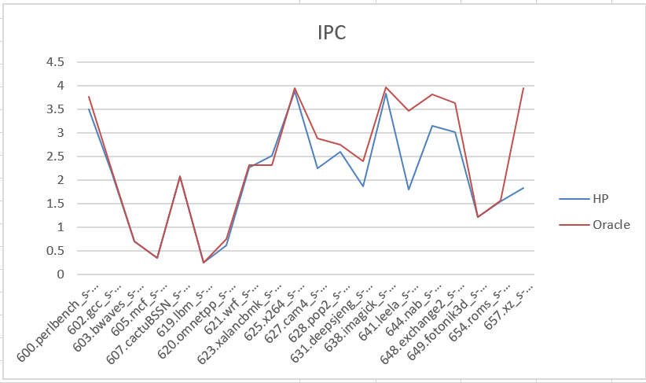
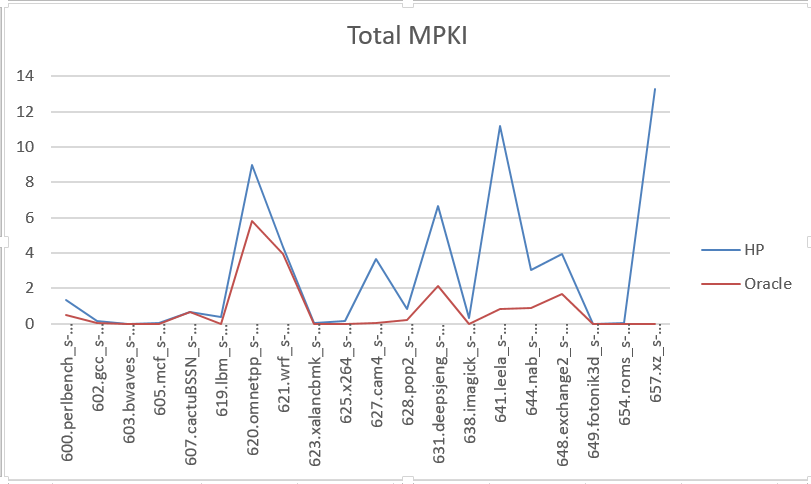
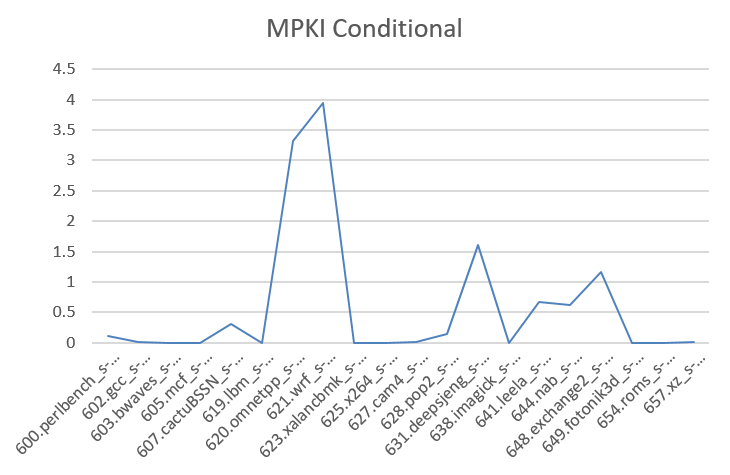

# Oracle conditional branch predictor

Реализация oracle branch predictor, скрипты для сбора трасс и статистики могут быть найдены в коммите [oracle](https://github.com/Trigger2000/ChampSim/commit/638ca6f2b644d884ee7563f587d84b1b7bc2bc4a). В `result.xlsx` представлены сырые табличные данные замеров, в директории `log_oracle` логи запусков oracle branch predictor. Трассы, на основании которых запускался oracle BP, в репозитории не представлены ввиду большого размера.

## IPC
На основании замеров IPC видно, что oracle branch predictor дает результаты, как минимум, не хуже, чем hashed_perceptron. Среднее геометрическое: $IPC_{hp} = 1.68$, $IPC_{oracle} = 1.92$

## MPKI
Рассмотрим теперь MPKI по всем типам бранчей. Видно, что он значительно улучшился, хотя и не везде до 0 (почему не до 0, написано далее). Cреднее геометрическое: $MPKI_{hp} = 0.47$, $MPKI_{oracle} = 0.06$

## MPKI conditional
Общий MPKI падает не до 0, поскольку присутствуют другие типы бранчей, которые все-таки предсказываются неправильно. Тем не менее, интересно рассмотреть отдельно MPKI для conditional branches.

Видно, что присутствуют бенчмарки, на которых MPKI для conditional branches далеко не 0. Немного изучив симулятор, было обнаружено, что финальное неправильное предсказание бранчей происходит не по причине branch predictor, а из-за неправильного предсказания btb predictor.  