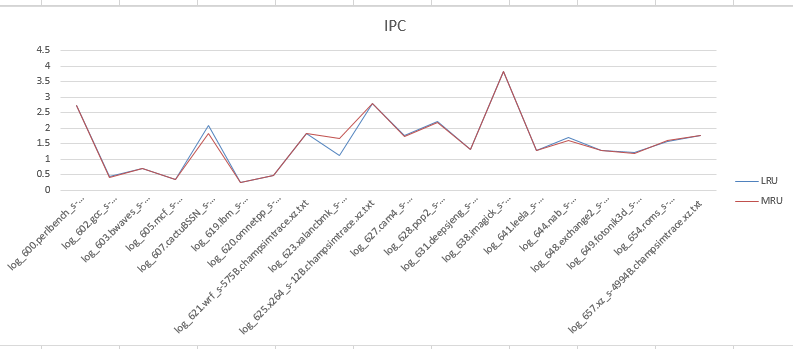
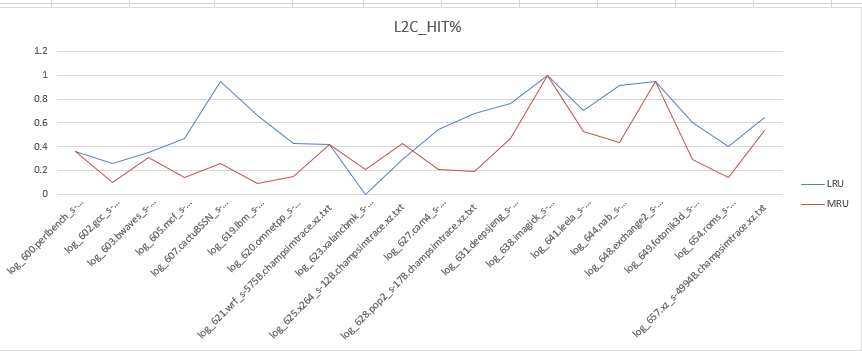
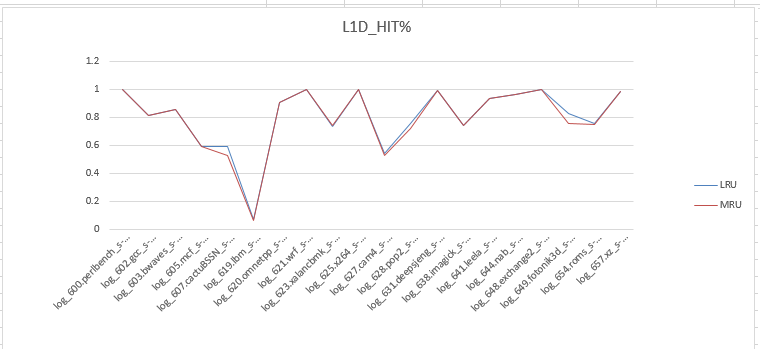
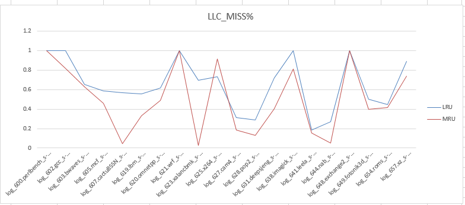

# Сравнение LRU и MRU политик замещения в L2 кэше

Код политики MRU, конфиг для запуска и скрипт для сбора статистики могут быть найдены в следующем коммите [Task 2 commit](https://github.com/Trigger2000/ChampSim/commit/01e47ba5b3d731a50315b43e94179e672795f5c0). Собранные ChampSim логи хранятся в директориях `log_lru` и `log_mru`. `result.xlsx` - таблица со всеми данными и графиками. 

## IPC

Сравнение IPC показывает, что политика MRU в среднем дает такие же показатели производительности, как и LRU. Но бывают бенчмарки, в которых какая-то из политик более выигрышна.

## L2С hit
Однако, доля попаданий в кэш L2 у LRU и MRU сильно отличается. Это логично, так как MRU вытесняет последний использованный элемент из кэша, который может понадобиться в скором времени (временная локальность), поэтому при последующем доступе к этому же элементу произойдет кэш-промах. Можно заметить, что в тесте под номером 623 MRU даже выигрывает по доле попаданий в кэш. В этом же тесте MRU выигрывает у LRU по IPC.

Однако, сильной просадки производительности не наблюдается в тех местах, где проигрывает MRU. Стоит также отметить, что количество доступов в L2 кэш не сильно изменилось (данные в result.xlsx).

## L1D hit
Поскольку кэши взаимосвязаны между собой, интересно посмотреть на происходящее и в других кэшах. В L1D кэше отличий LRU от MRU не было выявлено как по доле попаданий в кэш, так и по абсолютному числу обращенй.

## LLC
Рассмотрим еще один кэш. Как я понимаю, это last level cache (a.k.a. L3 cache?), так как у него самые большие емкостные характеристики по памяти. Видно, что LRU политика замещения дает, как правило, большее количество промахов, чем MRU. Причем из таблицы можно увидеть, что среднее количество обращений в LLC при использовании политики MRU (~170к) больше, чем при использовании LRU (~116к). Это явление вроде бы логично, так как часто возникает потребность переиспользовать недавно использованные элементы, а если их удалять, то надо доставать их из верхнеуровнего кэша (LLC). А поскольку это недавно использованный элемент в L2 кэше, то очень вероятно, что он еще не успел пропасть из LLC, поэтому и количество кэш промахов при MRU меньше, чем при LRU. Отдельно стоит отметить, что MRU значительно выигрывает у LRU по попаданиям в LLC на 623 тесте, в котором MRU выигрывал и по попаданиям в L2 кэш, и по производительности. 

## TLB
Из таблицы можно увидеть, что в среднем метрики по обращениям в TLB (как в data TLB, так и в shared TLB) почти не отличаются.